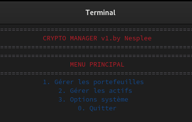

<div align="center">


# ASSET MANAGER - Keep an eye on your moves


</div>

<div align="center">

## Getting Started

</div>

### Clone & Setup
```bash
# Clone repository
git clone git@github.com:Nesplee/CRYPTO.git
cd CRYPTO

# Install required packages
sudo apt-get update
sudo apt-get install gcc make python3-pip
pip3 install dash pandas plotly
```
### Build & Launch
```bash
# Compile the program
cd CRYPTO.V3
make

# Run the Program
Option 1: Command Line Mode
./asset_manager

Option 2: Window Mode
./launcher
```
<div align="center">

## Core Features & Program Interface

</div>

<div align="center">

</div>

### Terminal Management

- Multi-portfolio management
- Transaction history logging
- Intuitive menu navigation
- Colored information display
- Complete portfolio control

<div align="center">

</div>

### Asset Operations & Analysis

- Buy/Sell assets management
- Performance tracking
- Profit/Loss calculations
- Transaction simulations
- Portfolio distribution view

<div align="center">

## Interactive Dashboard


</div>

- Real-time visualization
- Performance graphs
- Portfolio overview

**Important Note:**
- Dashboard requires a `MAIN.txt` file in the working directory
- Launch with: `python app.py`
- Access via browser at: `http://localhost:8050`
- File format must be JSON with portfolio data

<div align="center">

## User Guide

</div>

|  | <h3>Key Operations</h3><br>1. **Portfolio Management**<br>   - Create/Delete portfolios<br>   - Add/Withdraw funds<br>   - Track balance<br><br>2. **Asset Operations**<br>   - Buy/Sell assets<br>   - Update prices<br>   - View transaction history<br>   - Calculate profits/losses<br>   - Simulate sales<br><br>3. **Data Analysis**<br>   - Performance tracking<br>   - Portfolio distribution<br>   - Historical data<br>   - PNL calculations |
|---|---|

## Technical Details
- Written in C
- Python/Dash for visualization
- Make-based compilation
- Terminal-based UI
- Real-time data processing

## License
[MIT License](LICENSE)

## Author
Developed by Nesplee (2024)
